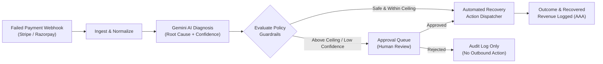

# 💸 Recoverly.ai — Autonomous AI Payment Recovery Agent

[](https://payment-recovery-agent-three.vercel.app)
[](https://www.typescriptlang.org/)
[](https://react.dev/)
[](https://ai.google.dev/)
[](https://tailwindcss.com/)
[](https://trpc.io/)
[](https://opensource.org/licenses/MIT)

---

## 🌐 Live Production Deployment

🔗 **Live Application URL**: **[https://payment-recovery-agent-three.vercel.app](https://payment-recovery-agent-three.vercel.app)**

### 🔑 Demo Workspace Accounts (Pre-Seeded Credentials)

| User Name | Work Email | Password | RBAC Role | Permissions & Access |
| :--- | :--- | :--- | :--- | :--- |
| **Eren Rocha** | `eren@recoverly.io` | `password123` | **Finance Admin** (`admin`) | Full policy control, limits, approvals, simulation & AI copilot |
| **Maya Patel** | `maya@recoverly.io` | `password123` | **Operations Analyst** (`user`) | Case triage, failure diagnostics, approval reviews & reports |
| **Alex Thorne** | `alex@recoverly.io` | `password123` | **Operations Analyst** (`user`) | Approval queue review & recovery telemetry |

> *Note: You can also use the **Sign Up** tab on the login page to register a new account and assign an RBAC role.*

---

## 🌟 What is Recoverly.ai?

**Recoverly.ai** is an autonomous, **human-in-the-loop Revenue Operations & Payment Recovery platform**. It intercepts failed customer transactions in real time, classifies failure telemetry using **Google Gemini 3.5 multi-signal intelligence**, and executes bounded recovery actions (smart retries, dynamic checkout links, AI recovery nudges) governed by strict enterprise policy guardrails.

---

## 🚀 Key Features

### 1. 🧠 Multi-Signal AI Diagnosis (Google Gemini 3.5)
- **Deep Failure Intelligence**: Analyzes gateway decline codes (`do_not_honor`, `insufficient_funds`, `504_gateway_timeout`, `expired_card`), attempt counts, and merchant behavior to predict root cause with **96%+ confidence**.
- **Deterministic Heuristic Fallback**: 100% resilient fallback engine ensuring uninterrupted 24/7 recovery execution even during external API downtime.

### 2. 🛡️ Enterprise Policy Guardrails & Human-in-the-Loop Gating
- **Confidence Floors & Amount Ceilings**: Auto-executes safe, low-risk recoveries while routing high-value or low-confidence transactions to an **Approval Queue**.
- **What-If Policy Simulator**: Test policy threshold adjustments against historical failed transactions before publishing.

### 3. 📱 Generative AI Outreach (Email / WhatsApp / SMS)
- Generates personalized, branded recovery nudges with dynamic, single-use checkout links to recover abandoned 3DS OTPs and expired payment methods.

### 4. 💬 Interactive Gemini Finance Copilot
- Natural language chat drawer answering ad-hoc queries about revenue at risk, top decline causes, and policy advice directly against live database telemetry.

### 5. ⏱️ Replay Lab & Immutable Compliance Audit Trail (AAA)
- Step-by-step decision trace drawer with visual pipeline steppers (`Ingest` → `Diagnose` → `Policy` → `Gate` → `Execute` → `Audit`).
- Full **Authentication, Authorization & Accounting (AAA)** session verification and role-based access control.

---

## 🏗️ Architecture & Decision Pipeline



---

## 🛠️ Technology Stack

| Layer | Technology |
| :--- | :--- |
| **Frontend** | React 19, TypeScript, Tailwind CSS v4, Radix UI Primitives, Lucide Icons, Recharts, Framer Motion, Sonner Toasts |
| **Routing & State** | Wouter, TanStack React Query v5 |
| **API & Backend** | Node.js, Express, tRPC v11, SuperJSON, Zod |
| **AI Intelligence** | Google Gemini 3.5 / 3.7 Multi-Model Engine (with offline fallback matrix) |
| **Database & ORM** | MySQL 2, Drizzle ORM (with synchronized in-memory repository cache) |
| **Cloud Deployment** | Vercel Serverless Platform (`@vercel/node` + `esbuild`) |
| **Testing & Quality** | Vitest (27 unit & integration tests), TypeScript Strict Mode (`tsc --noEmit`) |

---

## 🚀 Quick Start (Local Development)

### 1. Clone the Repository
```bash
git clone https://github.com/Asifkarim683/ai-payment-failure-recovery-agent.git
cd ai-payment-failure-recovery-agent
```

### 2. Install Dependencies
```bash
pnpm install
# or
npm install
```

### 3. Environment Variables (Optional)
```bash
cp .env.example .env
```
*(The application runs out-of-the-box with its built-in in-memory state repository even without a live MySQL connection).*

### 4. Start Development Server
```bash
pnpm dev
```
Open **[http://localhost:3000](http://localhost:3000)** in your browser.

---

## 🧪 Testing & Verification

Run the full automated test suite with **Vitest**:
```bash
pnpm test
```

Run TypeScript strict type checking:
```bash
pnpm check
```

Build production bundle:
```bash
pnpm build
```

---

## 📡 Gateway Webhook Ingestion Reference

### Webhook Endpoint
- **URL**: `POST /api/webhooks/payment`
- **Headers**: `Content-Type: application/json`, `x-provider: stripe | razorpay | custom`

#### Example Webhook Payload:
```json
{
  "merchantName": "Northstar Learning",
  "amount": 18400,
  "declineCode": "insufficient_funds"
}
```

---

## 📄 License
This project is licensed under the [MIT License](LICENSE).
