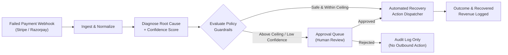

# 💸 recoverly — Autonomous AI Payment Recovery Agent

[](https://www.typescriptlang.org/)
[](https://react.dev/)
[](https://tailwindcss.com/)
[](https://trpc.io/)
[](https://orm.drizzle.team/)
[](https://opensource.org/licenses/MIT)

**recoverly** is an autonomous, **human-in-the-loop Payment Recovery & Revenue Operations platform**. It monitors failed customer transactions in real time, classifies failure telemetry using confidence scoring, and executes bounded recovery actions (e.g. smart retries, fresh checkout links, card update portals) governed by policy guardrails.

---

## 🌟 Key Features

### 1. 🧠 Explainable Diagnosis & Bounded Autonomy
- **Autonomous Recovery**: Low-risk failures (e.g., transient bank network timeouts, soft balance dips) are automatically resolved within safe ceilings.
- **Human-in-the-Loop Triage**: High-value transactions or low-confidence diagnoses are gated into an **Approval Queue** requiring explicit review before execution.
- **Explainability First**: Every case includes a step-by-step audit trace with decision reasons, timestamps, and matched policy criteria.

### 2. ⚡ Multi-Gateway Webhook Ingestion
- Ingests failed payment webhooks from **Stripe** (`charge.failed`, `payment_intent.payment_failed`), **Razorpay** (`payment.failed`), and custom JSON sources.
- Normalizes disparate decline codes into standardized root causes:
  - `insufficient_funds`
  - `otp_abandoned` / `3ds_dropped`
  - `timeout`
  - `expired_card`
  - `do_not_honor`
  - `cart_abandoned`

### 3. 🚀 Multi-Channel Recovery Dispatchers
- **`fresh_checkout_link`**: Generates a secure, single-use checkout link and dispatches customer notifications.
- **`delayed_retry`**: Schedules intelligent delayed retries around typical payroll and bank refresh cycles.
- **`update_payment_method`**: Dispatches self-serve billing portal links to update expired or invalid cards.
- **`immediate_retry`**: Dispatches instant retry requests to payment gateways for transient network drops.
- **`cart_recovery_nudge`**: Dispatches omnichannel cart reminders.

### 4. 🎛️ Policy Studio & What-If Simulation Sandbox
- Fine-tune retry limits, amount ceilings, minimum confidence floors, and cooldown periods.
- **Policy Sandbox**: Test proposed threshold adjustments against historical failed transactions to project auto-resolution rates, gated counts, and revenue delta before publishing.

### 5. ⏱️ Replay Lab (Time-Travel Decision Inspector)
- Step through past decisions at 1× speed to inspect exact telemetry and reasoning state available to the agent at every pipeline stage.

### 6. 📊 Reports & Data Exporters
- Comprehensive analytics for net recovered revenue, recovery rates, action performance, and governance SLAs.
- One-click **CSV** and **JSON** data export for accounting and audits.

### 7. 🔐 Authentication & Quick Persona Switcher
- Full session authentication with signed 256-bit JWT cookies.
- 1-click **Team Persona Switcher** for testing different access levels:
  - 👑 **Eren Rocha** &mdash; *Finance Admin* (Full Policy Governance & Approvals)
  - 🔍 **Maya Patel** &mdash; *Recovery Ops Analyst* (Triage & Approvals)
  - 📋 **Alex Thorne** &mdash; *Finance Reviewer* (Approvals & Analytics)

---

## 🏗️ Architecture & Decision Pipeline



---

## 🛠️ Technology Stack

| Layer | Technology |
| :--- | :--- |
| **Frontend** | React 19, TypeScript, Tailwind CSS v4, Radix UI Primitives, Lucide Icons, Recharts, Framer Motion, Sonner Toasts |
| **Routing & State** | Wouter, TanStack React Query v5 |
| **API & Backend** | Express 4, tRPC v11, SuperJSON, Zod |
| **Database & ORM** | MySQL 2, Drizzle ORM, Drizzle Kit (with synchronized in-memory fallback store) |
| **Testing & Tooling** | Vitest, TypeScript (Strict), Vite 7, esbuild, tsx |

---

## 🚀 Quick Start

### Prerequisites
- [Node.js](https://nodejs.org/) (v20+ recommended)
- [pnpm](https://pnpm.io/) or [npm](https://www.npmjs.com/)

### 1. Clone the Repository
```bash
git clone https://github.com/Asifkarim683/ai-payment-failure-recovery-agent.git
cd ai-payment-failure-recovery-agent
```

### 2. Install Dependencies
```bash
pnpm install
# or
npm install
```

### 3. Configure Environment (Optional)
```bash
cp .env.example .env
```
*(The platform runs out-of-the-box with its built-in in-memory repository store even without a live database connection).*

### 4. Start Development Server
```bash
pnpm dev
# or
npm run dev
```
Open **[http://localhost:3000](http://localhost:3000)** in your browser.

---

## 🧪 Testing & Verification

Run the full automated test suite with **Vitest**:
```bash
pnpm test
```

Run TypeScript strict type checking:
```bash
pnpm check
```

Build production bundle:
```bash
pnpm build
```

---

## 📡 API & Webhooks Reference

### Webhook Endpoint
- **URL**: `POST /api/webhooks/payment`
- **Headers**: `Content-Type: application/json`, `x-provider: stripe | razorpay | custom`

#### Example Payload (Synthetic / Custom):
```json
{
  "merchantName": "Vanguard Media",
  "amount": 14500,
  "declineCode": "otp_abandoned"
}
```

### tRPC Procedures
- `recovery.overview`: Returns live runs, cases, approvals, policies, and pipeline status.
- `recovery.listCases`: Filter cases by status, search term, or decline cause.
- `recovery.decideApproval`: Approve or reject gated actions with reviewer attribution.
- `recovery.simulatePolicy`: Runs what-if sandbox simulation against historical cases.
- `recovery.exportReport`: Generates structured CSV/JSON report exports.
- `auth.login` / `auth.quickLogin`: Authenticate with credentials or 1-click persona.

---

## 📂 Project Structure

```
payment-recovery-agent/
├── client/
│   ├── src/
│   │   ├── _core/hooks/        # Auth & session management hooks
│   │   ├── components/
│   │   │   ├── recovery/       # Modular recovery dashboard views
│   │   │   │   ├── OverviewTab.tsx
│   │   │   │   ├── CasesTab.tsx
│   │   │   │   ├── ApprovalsTab.tsx
│   │   │   │   ├── PolicyStudioTab.tsx
│   │   │   │   ├── PolicySimulatorModal.tsx
│   │   │   │   ├── ReplayLabTab.tsx
│   │   │   │   ├── ReportsTab.tsx
│   │   │   │   ├── DecisionTraceDrawer.tsx
│   │   │   │   ├── SimulatePaymentModal.tsx
│   │   │   │   └── ExportReportModal.tsx
│   │   │   └── ui/             # Radix UI primitives & styled components
│   │   ├── pages/
│   │   │   ├── Home.tsx        # Main dashboard orchestrator
│   │   │   └── Login.tsx       # Dedicated sign-in & persona portal
│   │   ├── App.tsx             # Application router & theme provider
│   │   └── index.css           # Design tokens, custom animations & styles
├── server/
│   ├── _core/                  # Express middleware, OAuth, cookies, Vite runner
│   ├── db.ts                   # Drizzle ORM repository with in-memory sync store
│   ├── execution.ts            # Recovery action execution & dispatchers
│   ├── recovery.logic.ts       # Domain logic, normalizers & policy simulation
│   ├── routers.ts              # tRPC app router
│   └── webhooks.ts             # Gateway webhook ingestion router
├── shared/
│   ├── const.ts                # Constants & cookie names
│   └── types.ts                # Shared TypeScript domain models
└── drizzle/
    └── schema.ts               # MySQL schema definitions
```

---

## 📄 License
This project is licensed under the [MIT License](LICENSE).
